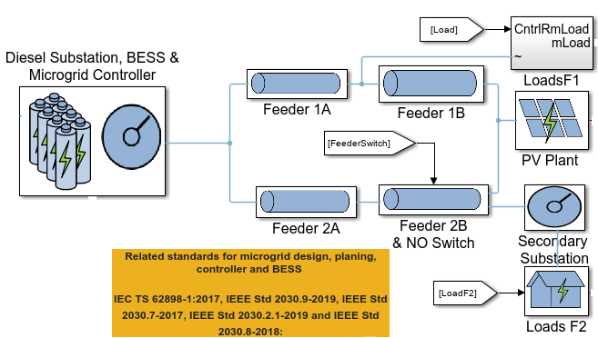

# Microgrid Design with Simscape
The International Council on Large Electric Systems (CIGRE) defines microgrids as 
‘electricity distribution systems containing loads and distributed energy resources, 
(such as distributed generators, storage devices, or controllable loads) that can be
 operated in a controlled, coordinated way either while connected to the main power 
network or while islanded’.
There are different types of microgrid applications such as residential microgrids, 
remote microgrids, industrial microgrids, and many more. This example shows the 
operation of a remote microgrid with diesel generator, battery energy storage 
system, photovoltaic, and loads in Simscape&trade;.

## Description and Performance Evaluation
Microgrids developed in remote places ensure reliable and uninterrupted power. 
The microgrid controller ensures economic and sustainable energy mix while 
maximizing fuel saving with stable renewable energy integrations. To learn 
how to develop, evaluate, and operate a remote microgrid, see the Design, 
Operation, and Control of Remote Microgrid example.
The planning objectives in this remote microgrid example include power 
reliability, renewable power usage, and reduction in diesel consumption.
 The key indices for economic benefits for the remote microgrid include life
 cycle cost, net revenue, payback period, and internal rate of return. 

In this example, these indices are improved through reduction in diesel
 usage, maximum usage of renewable energy, and operation of the BESS.
 This example uses various standards for covering, planning, designing,
 controlling, and testing. The control performance evaluation includes 
conformation of standards for power quality.

## Setup
* Clone and add the repository to the MATLAB&reg; path.
* Open MicrogridDesignWithSimscape.prj.
* In the toolstrip, use the project shortcut buttons to open the example.
* This example requires MATLAB R2022b or later.

Copyright 2022-2023 The MathWorks, Inc.

